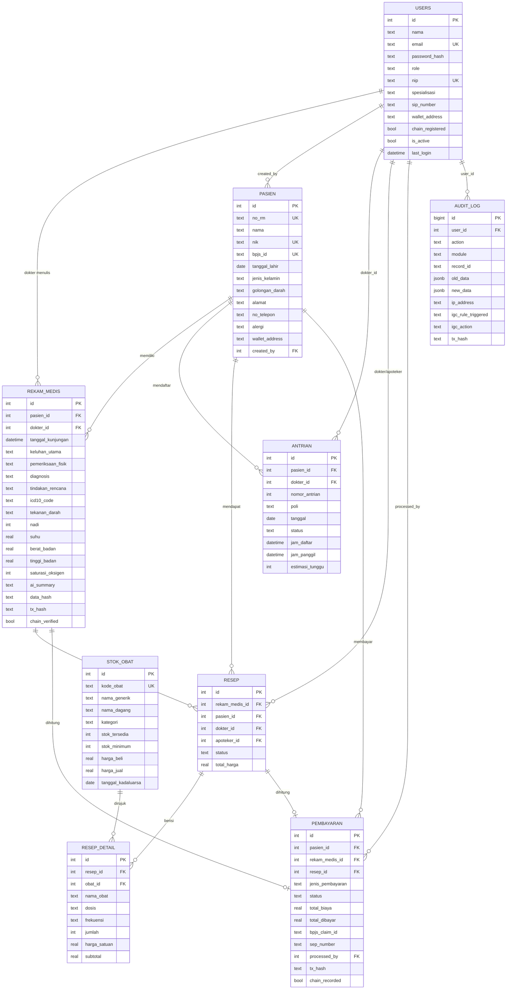

# 🗄️ Klinik Merah Putih — Database Schema

> Dokumentasi lengkap skema database untuk Sistem Manajemen Klinik Merah Putih.  
> Database: **PostgreSQL 15** (Production) / **SQLite** (Development)

---

## 📊 Entity Relationship Diagram



---

## 📋 Detail Setiap Tabel

### 1. `users` — Staff Klinik

| Kolom | Tipe | Constraint | Keterangan |
|---|---|---|---|
| `id` | SERIAL / INTEGER | PK AUTO | ID unik |
| `nama` | VARCHAR(200) | NOT NULL | Nama lengkap |
| `email` | VARCHAR(150) | UNIQUE, NOT NULL | Email login |
| `password_hash` | VARCHAR(255) | NOT NULL | bcrypt hash |
| `role` | ENUM/TEXT | NOT NULL, DEFAULT 'perawat' | `admin`, `dokter`, `perawat`, `apoteker`, `pasien` |
| `nip` | VARCHAR(50) | UNIQUE | Nomor Induk Pegawai |
| `spesialisasi` | VARCHAR(100) | | Spesialisasi dokter |
| `sip_number` | VARCHAR(100) | | Surat Izin Praktik (SIP) |
| `wallet_address` | VARCHAR(42) | | Ethereum wallet |
| `chain_registered` | BOOLEAN | DEFAULT FALSE | Status blockchain |
| `is_active` | BOOLEAN | DEFAULT TRUE | Soft delete flag |
| `last_login` | TIMESTAMP | | Waktu login terakhir |
| `refresh_token_hash` | VARCHAR(255) | | Refresh token |
| `created_at` | TIMESTAMP | DEFAULT NOW() | Auto timestamp |
| `updated_at` | TIMESTAMP | DEFAULT NOW() | Auto trigger |

---

### 2. `pasien` — Data Pasien

| Kolom | Tipe | Constraint | Keterangan |
|---|---|---|---|
| `id` | SERIAL | PK | ID unik |
| `no_rm` | VARCHAR(20) | UNIQUE, NOT NULL | Nomor Rekam Medis |
| `nama` | VARCHAR(200) | NOT NULL | Nama lengkap pasien |
| `nik` | VARCHAR(16) | UNIQUE, NOT NULL | NIK KTP |
| `bpjs_id` | VARCHAR(20) | UNIQUE | ID peserta BPJS |
| `tanggal_lahir` | DATE | NOT NULL | Tanggal lahir |
| `jenis_kelamin` | ENUM('L','P') | NOT NULL | L=Laki-laki, P=Perempuan |
| `golongan_darah` | VARCHAR(5) | | A, B, AB, O, (+/-) |
| `alamat` | TEXT | | Alamat lengkap |
| `no_telepon` | VARCHAR(20) | | Nomor telepon |
| `email` | VARCHAR(150) | | Email pasien |
| `nama_wali` | VARCHAR(200) | | Wali (anak/lansia) |
| `no_telepon_wali` | VARCHAR(20) | | Telepon wali |
| `alergi` | TEXT[] / JSON | | Daftar alergi |
| `riwayat_penyakit` | TEXT | | Riwayat penyakit |
| `foto_url` | VARCHAR(500) | | URL foto pasien |
| `wallet_address` | VARCHAR(42) | | Ethereum wallet |
| `is_active` | BOOLEAN | DEFAULT TRUE | Soft delete |
| `created_by` | INTEGER | FK → users(id) | Petugas pendaftar |
| `created_at` | TIMESTAMP | DEFAULT NOW() | |
| `updated_at` | TIMESTAMP | DEFAULT NOW() | |

---

### 3. `rekam_medis` — Electronic Medical Record (EMR)

Mengikuti format **SOAP** (Subjective, Objective, Assessment, Plan):

| Kolom | Tipe | SOAP | Keterangan |
|---|---|---|---|
| `id` | SERIAL | | PK |
| `pasien_id` | INTEGER | | FK → pasien(id), ON DELETE RESTRICT |
| `dokter_id` | INTEGER | | FK → users(id) |
| `tanggal_kunjungan` | TIMESTAMP | | DEFAULT NOW() |
| `keluhan_utama` | TEXT | **S** (Subjective) | Keluhan pasien |
| `pemeriksaan_fisik` | TEXT | **O** (Objective) | Hasil pemeriksaan fisik |
| `diagnosis` | TEXT | **A** (Assessment) | Diagnosis dokter |
| `tindakan_rencana` | TEXT | **P** (Plan) | Rencana tindakan |
| `icd10_code` | VARCHAR(20) | A | Kode ICD-10 |
| `tekanan_darah` | VARCHAR(20) | O | Contoh: "120/80" |
| `nadi` | INTEGER | O | BPM |
| `suhu` | DECIMAL(4,1) | O | °Celsius |
| `berat_badan` | DECIMAL(5,2) | O | Kilogram |
| `tinggi_badan` | DECIMAL(5,2) | O | Centimeter |
| `saturasi_oksigen` | INTEGER | O | SpO2 (%) |
| `catatan_tambahan` | TEXT | | Catatan lain |
| `lampiran_url` | TEXT[] | | File lab/foto |
| `ai_summary` | TEXT | | Output AI (filtered IGC) |
| `ai_disclaimer` | BOOLEAN | | DEFAULT TRUE |
| `dokter_approved` | BOOLEAN | | Dokter wajib approve AI |
| `data_hash` | VARCHAR(66) | | keccak256 → on-chain |
| `tx_hash` | VARCHAR(66) | | Ethereum tx hash |
| `chain_verified` | BOOLEAN | | On-chain verified |

---

### 4. `antrian` — Sistem Antrian Poli

| Kolom | Tipe | Keterangan |
|---|---|---|
| `id` | SERIAL | PK |
| `pasien_id` | INTEGER | FK → pasien |
| `dokter_id` | INTEGER | FK → users |
| `nomor_antrian` | INTEGER | Nomor urut |
| `poli` | VARCHAR(100) | Poli tujuan |
| `tanggal` | DATE | DEFAULT hari ini |
| `status` | ENUM | `menunggu` / `dipanggil` / `selesai` / `batal` |
| `jam_daftar` | TIMESTAMP | Waktu mendaftar |
| `jam_panggil` | TIMESTAMP | Waktu dipanggil |
| `jam_selesai` | TIMESTAMP | Waktu selesai |
| `estimasi_tunggu` | INTEGER | Estimasi (menit) |

---

### 5. `stok_obat` — Inventaris Obat

| Kolom | Tipe | Keterangan |
|---|---|---|
| `id` | SERIAL | PK |
| `kode_obat` | VARCHAR(50) | UNIQUE, kode internal |
| `nama_generik` | VARCHAR(200) | Nama generik obat |
| `nama_dagang` | VARCHAR(200) | Nama merek |
| `kategori` | VARCHAR(100) | Kategori obat |
| `satuan` | VARCHAR(50) | tablet, kapsul, ml, dll |
| `stok_tersedia` | INTEGER | Stok saat ini |
| `stok_minimum` | INTEGER | Batas minimum (alert) |
| `harga_beli` | DECIMAL(10,2) | Harga pembelian |
| `harga_jual` | DECIMAL(10,2) | Harga jual ke pasien |
| `tanggal_kadaluarsa` | DATE | Expiry date |

---

### 6. `resep` & `resep_detail` — Resep Obat

**Tabel resep (Header):**

| Kolom | Tipe | Keterangan |
|---|---|---|
| `rekam_medis_id` | INTEGER | FK → rekam_medis |
| `dokter_id` | INTEGER | Dokter penulis resep |
| `apoteker_id` | INTEGER | Apoteker yang menyiapkan |
| `status` | VARCHAR(50) | `menunggu` / `disiapkan` / `diambil` |
| `total_harga` | DECIMAL(12,2) | Total harga resep |

**Tabel resep_detail (Line items):**

| Kolom | Tipe | Keterangan |
|---|---|---|
| `obat_id` | INTEGER | FK → stok_obat |
| `dosis` | VARCHAR(100) | Contoh: "500mg" |
| `frekuensi` | VARCHAR(100) | Contoh: "3x sehari" |
| `jumlah` | INTEGER | Jumlah item |
| `harga_satuan` | DECIMAL(10,2) | Per-unit |
| `subtotal` | DECIMAL(12,2) | Kalkulasi |

---

### 7. `pembayaran` — Transaksi Keuangan

| Kolom | Tipe | Keterangan |
|---|---|---|
| `id` | SERIAL | PK |
| `pasien_id` | INTEGER | FK → pasien |
| `rekam_medis_id` | INTEGER | FK → rekam_medis (opsional) |
| `resep_id` | INTEGER | FK → resep (opsional) |
| `jenis_pembayaran` | ENUM | `BPJS` / `UMUM` / `SUBSIDI` / `ASURANSI` |
| `status` | ENUM | `pending` / `lunas` / `gagal` / `refund` |
| `total_biaya` | DECIMAL(12,2) | Total tagihan |
| `total_dibayar` | DECIMAL(12,2) | Jumlah yang dibayar |
| `bpjs_claim_id` | VARCHAR(100) | ID klaim P-Care untuk BPJS |
| `sep_number` | VARCHAR(100) | Surat Eligibilitas Peserta |
| `processed_by` | INTEGER | FK → users (admin) |
| `tx_hash` | VARCHAR(66) | Ethereum tx (PaymentLedger.sol) |
| `chain_recorded` | BOOLEAN | On-chain status |

---

### 8. `audit_log` — Log Audit (Immutable)

> ⚠️ **Tabel ini TIDAK memiliki kolom `updated_at`** — by design immutable (append-only).

| Kolom | Tipe | Keterangan |
|---|---|---|
| `id` | BIGSERIAL | PK |
| `user_id` | INTEGER | FK → users |
| `action` | VARCHAR(100) | CREATE, UPDATE, DELETE, LOGIN |
| `module` | VARCHAR(50) | pasien, rekam_medis, pembayaran |
| `record_id` | VARCHAR(100) | ID record yang diubah |
| `old_data` | JSONB | Snapshot data sebelum |
| `new_data` | JSONB | Snapshot data sesudah |
| `ip_address` | INET | IP address klien |
| `user_agent` | TEXT | Browser/app info |
| `igc_rule_triggered` | VARCHAR(10) | R001–R005 (IGC Guard) |
| `igc_action` | VARCHAR(20) | ALLOWED / BLOCKED / FLAGGED |
| `tx_hash` | VARCHAR(66) | Referensi SigmaGuard.sol |

---

## 🔑 Database Indexes

```sql
-- Pasien lookup
CREATE INDEX idx_pasien_nik ON pasien(nik);
CREATE INDEX idx_pasien_bpjs ON pasien(bpjs_id);
CREATE INDEX idx_pasien_no_rm ON pasien(no_rm);

-- Rekam Medis
CREATE INDEX idx_rekam_pasien ON rekam_medis(pasien_id);
CREATE INDEX idx_rekam_dokter ON rekam_medis(dokter_id);
CREATE INDEX idx_rekam_tanggal ON rekam_medis(tanggal_kunjungan);

-- Antrian
CREATE INDEX idx_antrian_tanggal ON antrian(tanggal, status);

-- Pembayaran
CREATE INDEX idx_pembayaran_pasien ON pembayaran(pasien_id);

-- Audit Log
CREATE INDEX idx_audit_user ON audit_log(user_id);
CREATE INDEX idx_audit_module ON audit_log(module, action);
CREATE INDEX idx_audit_created ON audit_log(created_at);

-- Stok Obat
CREATE INDEX idx_stok_kode ON stok_obat(kode_obat);
```

---

## ⚡ Auto-Update Trigger

Semua tabel (kecuali `audit_log`) memiliki trigger otomatis:

```sql
CREATE OR REPLACE FUNCTION update_updated_at()
RETURNS TRIGGER AS $$
BEGIN NEW.updated_at = NOW(); RETURN NEW; END;
$$ LANGUAGE plpgsql;

-- Applied to: users, pasien, rekam_medis, antrian, resep, stok_obat, pembayaran
```

---

## 🔄 Data Flow: Flutter ↔ Database

```
Flutter Model              API JSON Key          Database Column
──────────────             ──────────────        ──────────────
Patient.nama               "nama"                pasien.nama
Patient.nik                "nik"                 pasien.nik
Patient.tanggalLahir       "tanggal_lahir"       pasien.tanggal_lahir
Patient.jenisKelamin       "jenis_kelamin"       pasien.jenis_kelamin
Patient.noBPJS             "no_bpjs"             pasien.bpjs_id
Patient.phoneNumber        "phone_number"        pasien.no_telepon

PaymentModel.amount        "amount"              pembayaran.total_biaya
PaymentModel.paymentType   "payment_type"        pembayaran.jenis_pembayaran
PaymentModel.rekeningDebit "rekening_debit"      (custom field)
PaymentModel.qrisCode      "qris_code"           (custom field)

MedicalRecordModel.diagnosis    "diagnosis"       rekam_medis.diagnosis
MedicalRecordModel.treatment    "treatment"       rekam_medis.tindakan_rencana
MedicalRecordModel.doctorName   "doctor_name"     users.nama (JOIN)

User.role                  "role"                users.role
User.token                 "token"               (JWT, not stored in DB)
```
